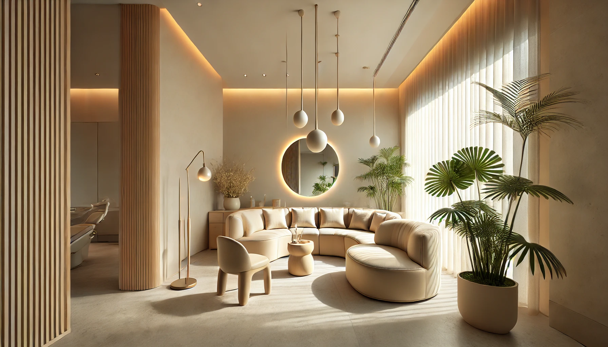

# 루체 치과의원 (LUCE DENTAL) — 디자인 & 구조 문서

가상 치과 포트폴리오 데모 사이트.
참고 사이트 [innercomfortingmind.com](https://innercomfortingmind.com) 의 톤·구조를 분석하여 치과용으로 재구성.

---

## 1. 브랜드

| 항목 | 값 |
|------|-----|
| 브랜드명 | LUCE / 루체 치과의원 |
| 의미 | Luce = 이탈리아어 "빛" |
| 슬로건 | 당신의 가장 아름다운 미소를 위해 |
| 위치(가상) | 서울 강남구 테헤란로 152 루체빌딩 2층 |
| 전화(가상) | 02-555-2580 |
| 개원(가상) | 2018년 |

---

## 2. 디자인 토큰

### 컬러 팔레트
```css
--white: #FFFFFF
--ivory: #FDFBF7         /* 기본 배경 */
--beige-light: #F5EFE6   /* 섹션 배경 */
--beige: #EDE5D8
--beige-dark: #DDD4C5
--tan: #C4B49A
--accent: #8B7355        /* 메인 액센트 (브라운) */
--accent-dark: #6B5640
--accent-light: #C9B99A
--text: #2E2A26          /* 본문 / 헤딩 */
--text-mid: #5A5148
--text-light: #908480
--border: #DDD7CE
--border-light: #EDE8E2
```

### 타이포그래피
- 한글: **Pretendard** (300/400/500/600)
- 영문/세리프: **Cormorant Garamond** (300/400, italic) — 영어 헤딩·라벨용
- H1: clamp(2.5rem, 5vw, 4rem) · 300 weight · serif
- H2: clamp(2rem, 4vw, 3rem) · 300 weight · serif
- 본문: 1rem · line-height 1.75~1.85
- `.section-label`: 영문 소제목 (대문자, letter-spacing 0.2em, accent 컬러)

### 여백 / 레이아웃
- 섹션 padding: 7rem 0 (모바일 4rem)
- 컨테이너 max-width: 1280px (narrow: 860px)
- 그리드: 2/3/4 컬럼 + 모바일 1컬럼

---

## 3. 디자인 원칙 (참고 사이트에서 추출)

1. **큰 여백** — 섹션 사이 최소 5~7rem
2. **영어 라벨 + 한글 대형 헤딩** 패턴 반복
3. **부드러운 베이지 톤 배경 교차** (white ↔ beige-light)
4. **감성적 카피** — 짧고 시적인 문장
5. **세리프 + 산세리프 혼용** — 격조와 가독성 동시
6. **이미지 비율** — 4:5(세로), 16:9(슬라이더), 4:3(갤러리)

---

## 4. 사이트 맵 (총 14페이지)

```
홈 (index.html)
├── 병원소개 (about.html)
├── 의료진 (doctors.html)
├── 진료안내 (services.html)
│   ├── 일반치과 (service-general.html)
│   ├── 교정치과 (service-orthodontics.html)
│   ├── 임플란트 (service-implant.html)
│   ├── 심미치과 (service-cosmetic.html)
│   ├── 소아치과 (service-pediatric.html)
│   └── 잇몸치료 (service-periodontics.html)
├── 공간 (space.html)
├── 장비 (equipment.html)
├── 진료시간·오시는길 (hours.html)
└── 상담·예약 (contact.html)
```

---

## 5. 페이지별 구성 요약

### index.html (홈)
1. Hero 슬라이더 (3장 자동 전환)
2. About 인트로 + 통계
3. 진료과목 6개 그리드
4. Why LUCE — 4가지 차별점 (다크 섹션)
5. 의료진 3명 카드
6. 공간 갤러리 (3장)
7. 장비 강조 스트립 (브라운 풀배너)
8. 진료시간 + 오시는길
9. 공지사항 3개
10. CTA 배너

### about.html
- 페이지 히어로 / 원장 인사말 (블록쿼트) / 진료 철학 3가지 / 연혁 8개(타임라인) / 인증 4개 / 수상 언론 4개

### doctors.html
- 의료진 3인 상세 (사진·인사말·학력·경력·자격·연수) + 협진 시스템

### service-*.html
- 페이지 히어로 + 개요 (이미지+텍스트) + 세부 진료 5~6개 (번호+제목+설명+태그)
- 일부 페이지: 진료 프로세스 단계, FAQ, 보증 안내 등 추가

### space.html
- 풀스크린 갤러리 히어로 + 컨셉 텍스트 + 대기실/진료실/상담실 갤러리

### equipment.html
- 통계 4개 + 장비 7종 상세 (지그재그 레이아웃) + 멸균 시스템 (다크 섹션)

### hours.html
- 진료시간표 + 연락처 박스 + 오시는길 + 비급여 진료비 표 3종

### contact.html
- 상담 방법 안내 3개 + 연락처 + 상담 폼 + FAQ 7개

---

## 6. 공통 컴포넌트 / 클래스

| 클래스 | 용도 |
|--------|------|
| `.btn`, `.btn--primary`, `.btn--outline`, `.btn--ghost` | 버튼 |
| `.section-label` | 영문 소제목 |
| `.section`, `.section--white/beige/dark` | 섹션 배경 |
| `.container`, `.container--narrow` | 가로 폭 |
| `.bg-cover` | 배경 이미지 헬퍼 (cover/center) |
| `.img-ph` | 베이지 그라디언트 플레이스홀더 |
| `.reveal`, `.reveal-delay-1~4` | 스크롤 페이드인 |
| `.faq-question`, `.faq-answer` | FAQ 아코디언 |

### 동적 컴포넌트
- 헤더/푸터: `js/components.js` 가 `#header-wrap`, `#footer-wrap` 에 주입
- 히어로 슬라이더: `.hero-slide.active` + `.hero-dot.active` (5초 자동)
- 모바일 메뉴: `.hamburger` 클릭 시 `.mobile-nav.open`
- 헤더는 히어로 위에서 투명, 스크롤 시 흰배경 (`.scrolled`)

---

## 7. 이미지 가이드

### 디렉토리 구조
```
images/
├── space/
│   ├── waiting-room.webp        (대기실 — 슬라이더 1)
│   ├── treatment-room.png       (진료실 — 슬라이더 2 / 메인)
│   ├── corridor-1.png           (복도 — 슬라이더 3)
│   ├── corridor-2.png           (복도 — 인트로 섹션)
│   ├── consultation-1.png       (상담실 메인)
│   ├── consultation-monitor.png (상담실 디지털 모니터)
│   └── consultation-detail.png  (상담실 디테일)
├── doctors/
│   ├── dr-kim.png               (대표원장 김유진 — 보철·임플란트)
│   ├── dr-lee.png               (부원장 이수아 — 교정)
│   └── dr-park.png               (진료원장 박진혁 — 소아)
├── equipment/
│   ├── cbct.png                 (3D CBCT)
│   ├── intraoral-scanner.png    (디지털 구강 스캐너)
│   ├── microscope.png           (치과용 현미경)
│   ├── surgical-guide.png       (디지털 임플란트 수술 가이드)
│   ├── laser.png                (치과용 레이저)
│   ├── autoclave.png            (Class B 멸균기)
│   └── anesthesia.png           (전동 마취 시스템)
├── services/
│   ├── general.png              (일반치과 도구 셋업)
│   ├── orthodontics.png         (인비절라인)
│   ├── cosmetic.png             (셰이드 가이드 / 라미네이트)
│   └── pediatric.png            (소아치과 어린이용 still life)
└── about/
    └── clinic-exterior-tall.png (병원 외관 — LUCE DENTAL 사이니지 포함)
```

> 모든 placeholder는 실제 이미지로 교체 완료.
> 장비·서비스 이미지에는 `bg-cover--brand` 클래스 적용 → 우측 하단에 "Luce" 워드마크 자동 오버레이 (워터마크 가림 + 브랜딩).

### 권장 사이즈
| 용도 | 비율 | 권장 픽셀 |
|------|------|-----------|
| 히어로 슬라이더 | 16:9 | 1792×1024 |
| 의료진 프로필 | 3:4 | 1024×1792 |
| 갤러리 | 4:3 | 1600×1200 |
| 인물 카드(원형/세로) | 3:4 | 800×1066 |
| 장비 | 4:3 또는 16:10 | 1600×1200 |

### 이미지 적용 패턴
플레이스홀더를 실제 이미지로 교체할 때:
```html
<!-- BEFORE -->
<div class="img-ph img-ph--interior" data-label="대기실"></div>

<!-- AFTER -->
<div class="bg-cover" 
     style="aspect-ratio:4/3; background-image:url('images/space/waiting-room.webp');">
</div>
```

히어로 슬라이더의 경우:
```html

```

### GPT 이미지 생성 공통 프롬프트
```
- 색감: warm ivory, beige, soft cream
- 조명: soft natural daylight
- 분위기: luxury minimal Korean dental clinic, calm
- photorealistic, editorial quality
- 인물 사진은 흰 가운, 친근한 미소, 35mm portrait, 베이지 스튜디오 배경
- 공간 사진은 사람 없음, 좌측이 약간 어둡게(텍스트 오버레이용)
```

---

## 8. 남은 작업

### 우선순위 이미지
모든 placeholder 적용 완료. 외관은 `about/clinic-exterior-tall.png` 1장으로 통일 (about.html 연혁 섹션). space.html에서는 외관 섹션 제거.

### 향후 확장 가능
- 실제 카카오맵/네이버맵 API 연동 (현재 텍스트 placeholder)
- 상담 폼 백엔드 연동 (현재 데모 alert)
- 블로그/공지사항 상세 페이지
- 다국어 (영문 EN) 페이지

---

## 9. 외부 링크 정책

포트폴리오 데모이므로 모든 외부/실제 이동 링크는 자체 페이지로만 연결:
- 전화: `tel:02-555-2580` (실제 발신은 가상 번호)
- 이메일: `info@lucedental.kr` (가상 도메인)
- 카카오톡/SNS: 별도 처리하지 않음
- 지도: 텍스트 placeholder만 (실제 좌표 사용 X)

---

## 10. 브라우저 지원

- Chrome / Safari / Firefox / Edge 최신 버전
- IE 미지원
- 모바일 반응형 breakpoint: 1024px / 768px
- webp 이미지 사용 (모든 모던 브라우저 지원)
